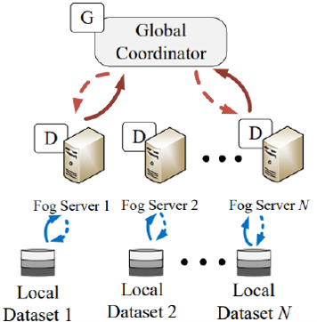
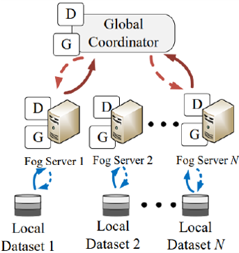
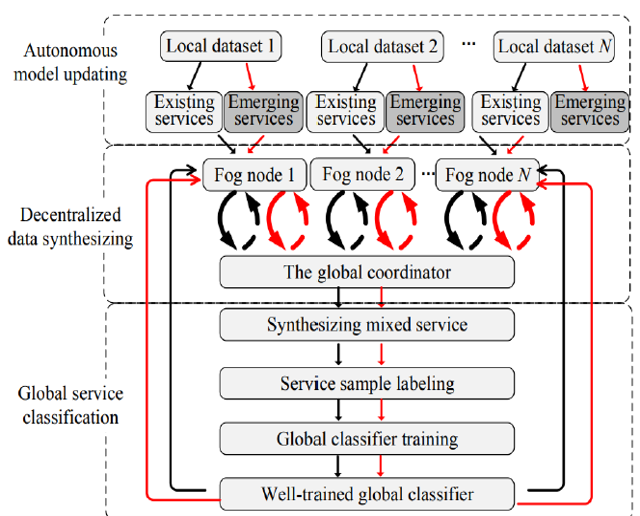

# 📡 Network Traffic Classification using Semi-Supervised Federated Learning with GAN-Based Data Augmentation

## 🧠 Overview

This project focuses on classifying network traffic into application-specific classes using a progression of models from traditional Machine Learning to advanced Semi-Supervised Federated GANs. The objective was to handle data privacy concerns using federated learning while leveraging GANs for effective synthetic sample generation in low-label regimes.

---

## 📊 Project Pipeline

1. **Traditional Models**: Started with baseline ML models including:
   - Logistic Regression
   - Support Vector Machines (SVM)
   - Random Forest

2. **Deep Learning Models**:
   - Artificial Neural Networks (ANN)
   - Convolutional Neural Networks (CNN)
   - Long Short-Term Memory Networks (LSTM)

3. **Hybrid Models**:
   - **Autoencoder + CNN**: Extracted compressed features using an autoencoder and passed them to a CNN classifier.
   - **Autoencoder + LSTM**: Combined autoencoder with LSTM, though it showed poorer results compared to standalone LSTM.

4. **GAN-Based Models**:
   - Conditional GAN (CGAN) + CNN for synthetic data augmentation.
   - Semi-Supervised GANs with Federated Learning.

5. **Final Models**:
   - **FGAN-I**: Federated GAN with separate Discriminators per client and a central Generator.
   - **FGAN-II**: Fully federated Generator and Discriminator with Feature Matching Loss.

---

## 🧩 Architecture Visualizations

### 🔹 FGAN-I Architecture

*Each client has its own Discriminator. A central Generator is updated based on feedback.*

### 🔹 FGAN-II Architecture

*Generator and Discriminator are both updated in a federated manner using Feature Matching Loss.*

### 🔹 Semi-Supervised Federated GAN Pipeline

*Combines federated learning, GANs, and pseudo-labeling to handle unlabeled network data.*

---

## ⚙️ Pseudo-Labeling Techniques

Two pseudo-labeling methods were applied on test data before adding it back for training:

1. **DEC (Deep Embedded Clustering)**: 
   - Extracted intermediate CNN features.
   - Used KMeans clustering to assign pseudo-labels.

2. **Entropy + Confidence Thresholding**: 
   - Selected samples where model confidence > 0.9 and entropy < 0.5 for reliable pseudo-labeling.

---

## 📈 Final Results

| Model Type     | Pseudo Labeling | Accuracy | Precision | Recall | F1-Score |
|----------------|------------------|----------|-----------|--------|----------|
| FGAN-I         | DEC              | 94.27%   | 0.943     | 0.942  | 0.942    |
| FGAN-I         | Entropy+Conf     | 98.68%   | 0.987     | 0.986  | 0.986    |
| FGAN-II        | DEC              | 92.02%   | 0.920     | 0.920  | 0.919    |
| FGAN-II        | Entropy+Conf     | 99.48%   | 0.994     | 0.994  | 0.994    |

---

## 🧪 Experimentation Details

- **Dataset**: 17-class App Network Traffic Dataset 
- **Preprocessing**: StandardScaler, label encoding, stratified partitioning
- **Federated Clients**: 5 clients simulated using `random_split()` on training data
- **Optimizers**: Adam, LR scheduling, Focal Loss for robust training on imbalanced data

---

## 🛠 Technologies Used

- Python, PyTorch, scikit-learn, KMeans (for DEC)
- Federated Learning (simulated via PyTorch)
- Semi-supervised techniques using synthetic sample labeling

---

## 📌 Highlights

- Developed multiple GAN variants for low-label regime classification.
- Integrated Federated Learning to maintain data privacy.
- Benchmarked all models through consistent evaluation.
- Found that FGAN1 with DEC and Entropy+Confidence pseudo-labeling outperforms others in low-data environments.

---

## 📄 Publication

📝 *Also published a research paper in IEEE on this project titled:*  
- 🏅 [View Project Certificate](./images/certificate.png)
-**"Network Traffic Classification using Semi-Supervised Federated Learning with GAN-Based Data Augmentation"**

---

